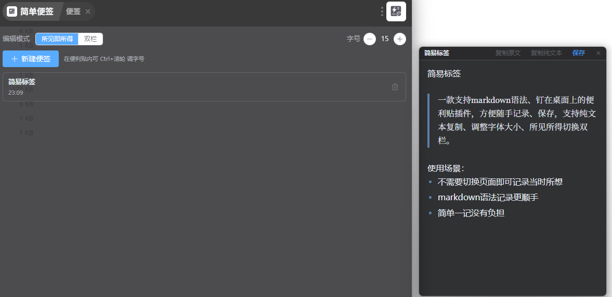

# easynote · 简单便签

> 轻量、好用的桌面便签，支持 Markdown 所见即所得、纯文本复制、字号控制。



easynote 是一个 [ZTools](https://github.com/ztool-center/ztools) 插件，让你随时在桌面贴一张可编辑的便签，随手记录、随时查阅。

## ✨ 功能特性

- **桌面便利贴**：从 ZTools 唤起后，便签以独立窗口形式贴在桌面右上角，无边框、置顶、可拖动，不占用主窗口。
- **Markdown 所见即所得**：输入 `# 标题`、`**粗体**` 等语法即时渲染成富文本；也可切换为「双栏」模式（左编辑右预览）。
- **纯文本复制**：一键复制 Markdown 原文，或复制剥离标记的纯文本。
- **字号控制**：在设置里调整字号，或在便利贴内 `Ctrl + 滚轮` 实时缩放。
- **草稿与保存**：新建便签默认为草稿（不落库），点击「保存」才写入并进入已保存列表，关闭未保存即丢弃。
- **本地存储**：所有便签保存在本地（ZTools dbStorage），无需联网，随用随取。
- **暗色模式**：跟随系统主题自动适配浅色/暗色。

## 📦 安装

将构建产物 `dist/` 目录的内容放入 ZTools 插件目录，或在 ZTools 中安装本插件。

开发调试：

```bash
npm install
npm run dev
```

构建生产版本：

```bash
npm run build
```

## 🚀 使用

### 1. 唤起便签

在 ZTools 输入以下任一指令：

- `便签`
- `note`
- `bj`

进入主页面（管理面板）。

### 2. 主页面

主页面是便签的管理中心：

- **设置区**：选择编辑模式（所见即所得 / 双栏），调整字号。
- **新建便签**：点击「新建便签」，在桌面弹出一张空白便利贴。
- **已保存列表**：点击列表中的便签在桌面打开编辑；点击右侧删除按钮移除。

### 3. 桌面便利贴

桌面便利贴是一个独立的置顶小窗口：

- **输入**：所见即所得模式下直接输入 Markdown 语法即时渲染成富文本；双栏模式下左侧编辑、右侧实时预览。
- **保存**：点击「保存」将当前便签写入本地存储（首次保存为新建，之后为更新）。
- **复制**：点击「复制原文」复制 Markdown 源文本；点击「复制纯文本」复制剥离标记的纯文本。
- **字号**：在便利贴内 `Ctrl + 滚轮` 实时调整字号（与主页面设置同步并持久化）。
- **拖动**：按住便利贴顶部标题栏即可拖动窗口位置。
- **关闭**：点击右上角 × 关闭便利贴。

> 桌面便利贴是单例窗口：再次输入「便签」唤起主页面可新建/打开其他便签。如需切换到另一张已保存便签，请先关闭当前便利贴再从列表打开。

### 4. 编辑模式

- **所见即所得**：输入即渲染，适合快速书写、注重排版效果的场景。
- **双栏**：左 Markdown 源码、右渲染预览，适合需要对照源码或精修语法的场景。

在主页面设置区切换，选择会持久化，下次打开自动沿用。

## 🗃️ 数据存储

便签保存在 ZTools 的本地存储（dbStorage）中，关闭插件、重启 ZTools 后依旧保留。每条便签包含：

- **标题**：自动取自首个标题或首行非空文本。
- **内容**：Markdown 源文本。
- **创建时间 / 更新时间**：用于列表排序（按更新时间倒序）。

## ⚙️ 技术栈

- Vue 3 + Vite + TypeScript
- Markdown 渲染：[marked](https://marked.js.org/)
- 所见即所得编辑器：[Milkdown](https://milkdown.dev/)
- UI 组件：[Element Plus](https://element-plus.org/)

## 📄 许可

MIT

## 更新日志

### v1.5.0 - 2026-07-22
- 修复便利贴关闭后插件进程未结束的问题

### v1.4.0 - 2026-07-21
- 新增直接新建便签指令（`新建便签` / `新便签` / `new-note`）
