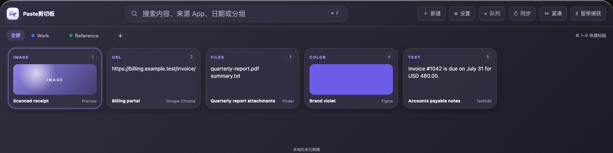

# Paste剪切板

Paste剪切板是一款 Paste 风格的本地优先剪贴板历史插件。它提供独立贴边浮窗、实时历史、搜索、分组、预览、快捷粘贴与连续粘贴队列，并为 ATools 和 ZTools 分别提供原生宿主实现。

> 内部插件 ID、包名和同步协议继续使用 `pasteboard-pro` / `PasteboardPro/v1`，用于保持安装、数据与跨宿主同步兼容；用户界面统一显示“Paste剪切板”。

## 界面截图



## 核心功能

- 自动记录文本、富文本、HTML、URL、颜色、图片、PDF 和文件剪贴板内容。
- 首次运行后自动登记为随 ZTools 启动，并在后台持续监听剪贴板变化。
- 按内容、来源 App、日期、类型和分组搜索历史。
- 创建、重命名、排序和着色分组，支持拖动内容加入或移出分组。
- 预览文本、图片与 PDF，支持 Quick Look、图片旋转和 macOS Vision OCR。
- 使用方向键浏览，按 Enter 粘贴，按 Escape 关闭，支持 `Command + 1–9` 快捷粘贴。
- 将多项内容加入粘贴队列，关闭面板后连续按 `Command + V` 依次粘贴。
- 新复制内容实时定位；图片优先加载轻量缩略图，避免阻塞历史列表。
- 支持紧凑布局和上、下、左、右贴边显示，始终跟随当前鼠标所在屏幕。
- 提供历史保留、附件预算、敏感内容排除、屏幕共享保护和暂停捕获。
- 使用端到端加密 WebDAV 同步正文、OCR、分组、图片与 PDF。

## 使用方式

1. 在 ZTools 中搜索 `Paste剪切板`、`剪贴板`、`paste` 或 `clipboard`。
2. 首次打开后，插件会登记为随 ZTools 启动；后续无需手动打开即可持续记录复制内容。
3. 使用鼠标、方向键或搜索框定位内容，按 Enter 或点击卡片完成粘贴。
4. 多选后点击“队列”，即可连续按 `Command + V` 逐项粘贴。
5. 在设置中选择贴边位置、历史保留策略、附件预算和隐私规则。

## 平台支持

- macOS：完整支持历史捕获、独立贴边浮窗、直接粘贴、Quick Look、Vision OCR、屏幕共享保护和连续粘贴队列。
- Windows / Linux：支持历史浏览、搜索、分组、复制和元数据预览；macOS 原生能力会安全降级并给出提示。
- ATools：使用 Svelte UI 与 ATools 原生 bridge。
- ZTools：使用 Vue 3 UI、Electron preload 与 macOS 原生 helper。

## 隐私与同步

- 历史和附件默认保存在宿主本地数据目录。
- 隐私规则在正文、OCR 和附件落盘前执行。
- WebDAV record、blob 和 index 均经过端到端加密。
- WebDAV 凭据与派生密钥不进入 renderer，本地密钥材料存放于系统钥匙串。
- 搜索工具仅返回脱敏的结构化元数据，不把 OCR 正文写入 Agent 审计内容。

## 技术实现

- ATools：Svelte 5 + TypeScript。
- ZTools：Vue 3 + TypeScript + Electron preload。
- 共享包：查询与选择状态、分组与粘贴队列、设计 token、加密同步协议和跨宿主 fixture。
- macOS helper：Swift Vision OCR；PR 构建会生成签名与 SHA-256 证明并校验最终 ZIP。
- 可视化验证：Playwright 覆盖双宿主、四种停靠、明暗主题、紧凑布局、减弱动效及关键功能态。

## 本地开发

```bash
corepack pnpm@11.7.0 install --frozen-lockfile
corepack pnpm@11.7.0 --filter @pasteboard-pro/ztools dev
```

ZTools 开发页面默认由 Vite 启动；ATools 与 ZTools 使用独立 UI，不共享前端框架。

## 验证

CI 使用 Node.js 24 与 pnpm 11.7.0：

```bash
pnpm typecheck
pnpm --filter @pasteboard-pro/atools typecheck
pnpm --filter @pasteboard-pro/ztools typecheck
pnpm typecheck:visual
pnpm test:contract
pnpm test:release-archive
pnpm test:visual-artifact
pnpm test:visual-contract
pnpm test
pnpm benchmark:search
pnpm test:visual
pnpm verify:visual-artifact
```

PR workflow 还会在 macOS 构建并临时签名 Vision helper、校验 helper 证明、打包插件 ZIP，并上传性能报告、双宿主截图矩阵和最终压缩包验证报告。

## 目录结构

```text
apps/atools/                ATools Svelte UI 与 bridge adapter
apps/ztools/                ZTools Vue UI、preload、窗口与 macOS helper
packages/core/              查询、选择、分组、粘贴队列与数据类型
packages/design-tokens/     停靠、尺寸、颜色和视觉 token
packages/sync-protocol/     加密 wire format、HLC merge 与 vault helpers
packages/contract-fixtures/ 跨宿主固定 fixture
screenshots/                PR 与插件说明截图
scripts/                    workspace、性能、视觉与发布包门禁
```

## 发布边界

插件保持本地优先且核心浏览、搜索、分组和复制能力不依赖模型、账号或网络。远程 PR 构建与视觉 artifact 全部通过后，才应将对应提交标记为可发布版本。
