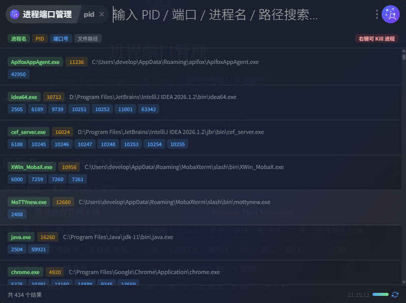
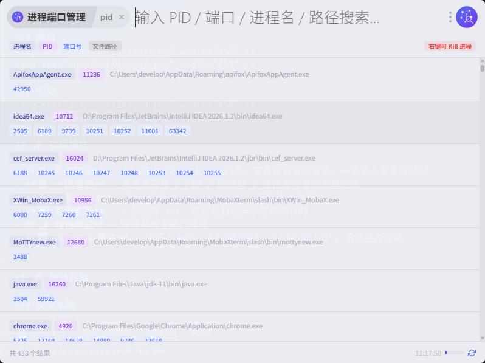

<p align="center">
  
</p>

<h1 align="center">进程端口管理</h1>
<p align="center"><em>Process Port Manager — 为 ZTools 打造的进程端口管理插件</em></p>


> 🤖 **本项目由 [Vibe Coding](https://github.com/nicepkg/vibe-coding) 维护** — AI 辅助驱动的开发模式，让想法快速变为代码。

---

## 💡 为什么选择 Process Port Manager？

- **UI 和谐统一** — 背景、字体、配色沿用 ZTools 本身，如同原生功能，无视觉割裂感
- **信息简洁清晰** — 只展示进程名、PID、端口、路径等关键信息，点击任意字段即可一键复制
- **开放源代码** — MIT 协议开源，可自由修改、扩展、二次开发

---


## 📸 界面预览
### 暗黑



### 明亮



## ✨ 功能特性

- **🔍 多维搜索** — 支持按进程名、PID、端口号、文件路径模糊搜索，一处输入全字段匹配
- **📋 一键复制** — 点击进程名 / PID / 端口号 / 路径即可复制到剪贴板
- **⚡ 一键 Kill** — 确认后通过 `taskkill /F` 强制终止进程
- **🔄 自动刷新** — 5 秒缓存 TTL，进度条直观展示缓存倒计时
- **🌙 暗色模式** — 跟随系统主题自适应
- **🪟 Windows 原生** — 基于 `wmic` / `netstat` / `tasklist`，无第三方依赖


## 🚀 快速开始

### 安装依赖

```bash
npm install
```

### 开发模式

```bash
npm run dev
```

开发服务器将在 `http://localhost:5173` 启动。ZTools 会自动加载开发版本。

### 构建生产版本

```bash
npm run build
```

构建产物将输出到 `dist/` 目录。

## 📁 项目结构

```
.
├── public/
│   ├── logo.svg                  # 插件图标（SVG）
│   ├── plugin.json               # 插件配置（功能指令、平台等）
│   └── preload/
│       └── services.js           # Node.js 层：进程枚举、端口扫描、Kill
├── src/
│   ├── main.tsx                  # 入口文件
│   ├── main.css                  # 全局样式（含暗色模式）
│   ├── App.tsx                   # 根组件（路由分发）
│   ├── env.d.ts                  # 类型声明（ztools / services）
│   └── ProcessManager/
│       ├── index.tsx             # 主界面组件
│       ├── index.css             # 组件样式
│       ├── search.ts             # 多功能搜索（进程名/PID/端口/路径）
│       └── useProcessData.ts     # 进程数据获取 + 缓存 + 定时刷新
├── index.html
├── vite.config.js
├── tsconfig.json
├── package.json
└── README.md
```

## 🧠 核心逻辑

### 数据流

```
┌─────────────────────┐
│   services.js       │  ← Node.js preload
│  ─ listProcesses()  │     wmic / tasklist
│  ─ scanPorts()      │     netstat -ano
│  ─ killProcess()    │     taskkill /F
└────────┬────────────┘
         │ window.services.*
         ▼
┌─────────────────────┐
│  useProcessData.ts  │  ← 5s 缓存 + 防抖刷新
│  ─ processes[]      │
│  ─ refresh()        │
└────────┬────────────┘
         ▼
┌─────────────────────┐
│  search.ts          │  ← 按 PID/端口/进程名/路径 过滤
│  ─ searchProcesses()│
└────────┬────────────┘
         ▼
┌─────────────────────┐
│  ProcessManager     │  ← React 组件渲染
│  → 进程列表 +  Kill │
└─────────────────────┘
```

### 主要依赖

| 模块                       | 职责                                                                  |
| -------------------------- | --------------------------------------------------------------------- |
| `services.js`              | 通过 `wmic` 枚举进程、`netstat -ano` 扫描端口、`taskkill /F` 终止进程 |
| `useProcessData.ts`        | 管理进程数据状态，5 秒缓存 TTL，自动/手动刷新                         |
| `search.ts`                | 多字段模糊匹配：进程名、PID、端口、路径                               |
| `ProcessManager/index.tsx` | 主界面：搜索栏、结果列表、Kill 按钮、Toast 提示                       |

## 🔧 插件配置

编辑 `public/plugin.json`：

```json
{
  "name": "process-manager",
  "title": "进程端口管理",
  "description": "快速搜索进程、端口、PID、路径，支持一键 Kill 进程，支持深色模式",
  "features": [
    {
      "code": "process",
      "explain": "快速搜索进程、端口、PID，支持一键 Kill",
      "cmds": ["pid", "port", "process", "端口", "进程", "进程管理"]
    }
  ],
  "platform": ["win32"]
}
```

触发指令：`pid` / `port` / `process` / `端口` / `进程` / `进程管理`

> ⚠ 当前仅支持 Windows 平台（依赖 `wmic`、`netstat`、`taskkill`）。

## 📦 构建与发布

```bash
npm run build     # 构建
```

将 `dist/` 目录中的所有文件复制到 ZTools 插件目录即可使用。

## 🎨 样式开发

组件使用 CSS 变量实现主题适配与暗色模式：

```css
/* 跟随 ZTools 主题 */
.pm {
  background: var(--bg-color);
  color: var(--text-color);
}

/* 暗色模式自适应 */
@media (prefers-color-scheme: dark) {
  .pm-item {
    background: #2a2a2a;
  }
}
```

## 🤖 Vibe Coding 说明

本项目采用 **Vibe Coding** 理念进行维护：

- **AI 优先** — 需求描述直接转化为可用代码，快速迭代
- **最小阻力** — 减少手动配置，聚焦核心功能
- **持续优化** — 在 AI 辅助下不断重构和完善

欢迎通过 Issue 或 PR 贡献想法和改进！


## 📄 开源协议

MIT License

---

**优化建议或问题？欢迎提出 Issue！** 🎉
