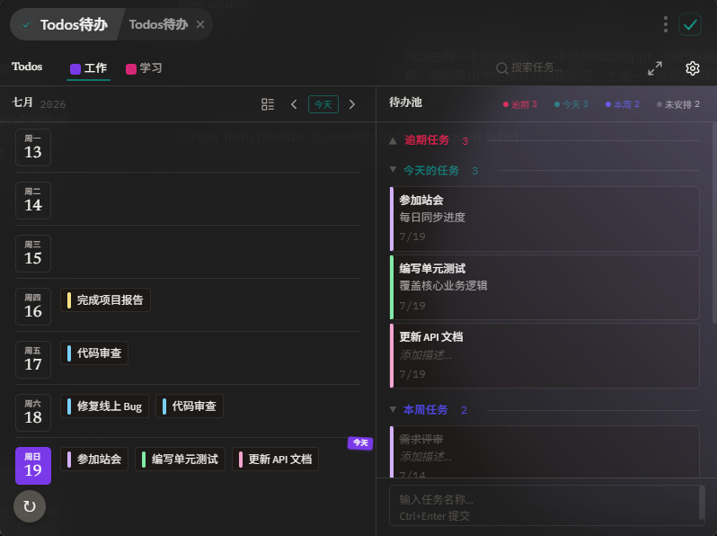
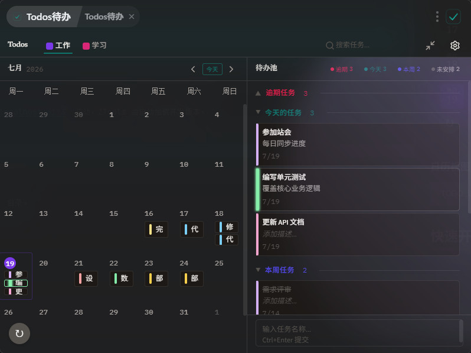

<p align="center">
  
</p>

<h1 align="center">Todos</h1>

<p align="center">
  <strong>高颜值、快捷高效的待办事项管理工具</strong>
  <br>
  一个基于 <b>React 19 + Vite + TypeScript</b> 构建的 ZTools 插件
</p>

<p align="center">
  
  
  
  
</p>

---

## 功能特性

- **日历视图** — 以日历形式直观展示每日待办，快速定位任务日期
- **拖拽操作** — 支持拖拽调整任务日期与排序，交互流畅直观
- **延期复活** — 过期未完成的任务自动延期，不再遗漏
- **快捷编排** — 快速创建、编辑、完成待办事项，操作路径极短
- **暗色模式** — 跟随系统主题，护眼又美观

## 应用截图

### 周视图

### 日历视图


## 快速开始

```bash
# 安装依赖
npm install

# 启动开发模式
npm run dev
```

开发服务器将在 `http://localhost:5173` 启动，ZTools 会自动加载开发版本。

```bash
# 构建生产版本
npm run build
```

构建产物将输出到 `dist/` 目录。

## 项目结构

```
├── public/
│   ├── logo.svg              # 插件图标
│   └── plugin.json           # 插件配置文件
├── src/
│   ├── main.tsx              # 入口文件
│   ├── main.css              # 全局样式
│   ├── App.tsx               # 根组件
│   ├── env.d.ts              # 类型声明
│   └── ...
├── index.html                # HTML 模板
├── vite.config.js            # Vite 配置
└── package.json              # 项目依赖
```

## 开发指南

### 修改插件配置

编辑 `public/plugin.json` 修改插件名称、描述、功能配置等。

### 创建新功能

1. 在 `src/` 下创建功能组件目录
2. 在 `src/App.tsx` 中注册路由
3. 在 `public/plugin.json` 中添加功能配置

### 使用 Node.js 能力

通过 `public/preload/services.js` 扩展 Node.js 服务，在组件中通过 `window.services` 调用。

### 使用 ZTools API

通过 `window.ztools` 访问 ZTools 提供的 API，如 `getClipboardContent()`、`hideMainWindow()`、`showTip()` 等。

## 构建与发布

1. `npm run build` — 构建生产版本
2. 将 `dist/` 目录内容复制到 ZTools 插件目录进行测试
3. 确保 `plugin.json` 信息完整，准备截图后提交到 ZTools 插件市场

## 开源协议

MIT License